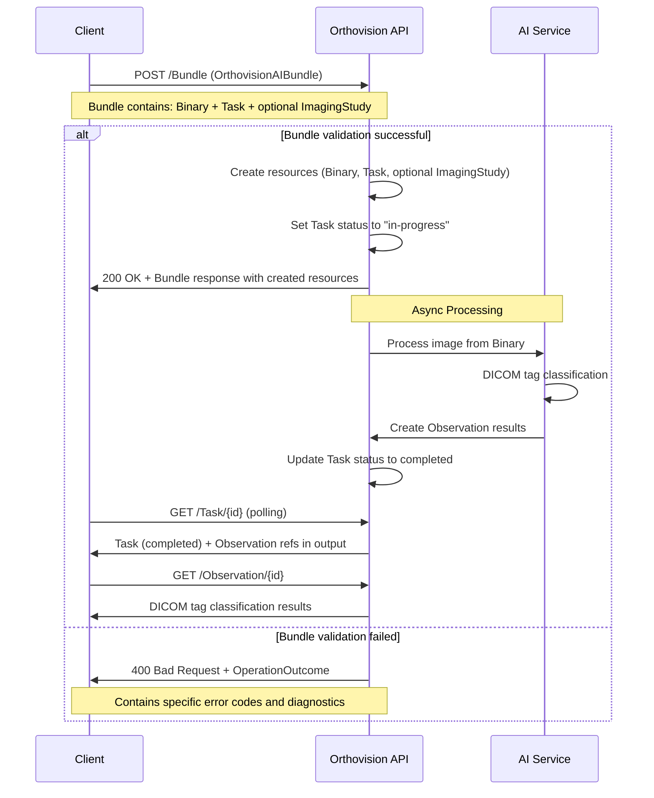

The following diagram shows the complete classification workflow:


## Bundle-Based Workflow

### Step 1: Submit Bundle

**Endpoint**: `POST [base]/Bundle`

**Input**: `OrthovisionAIBundle` containing Binary, Task, and optional ImagingStudy

```json
{
  "resourceType": "Bundle",
  "type": "transaction",
  "entry": [
    {
      "fullUrl": "urn:uuid:binary-12345",
      "resource": {
        "resourceType": "Binary",
        "contentType": "image/jpeg",
        "data": "base64EncodedImageData..."
      },
      "request": {
        "method": "POST",
        "url": "Binary"
      }
    },
    {
      "fullUrl": "urn:uuid:study-12345",
      "resource": {
        "resourceType": "ImagingStudy",
        "status": "available",
        "subject": {
          "reference": "Patient/patient-12345"
        }
      },
      "request": {
        "method": "POST",
        "url": "ImagingStudy"
      }
    },
    {
      "fullUrl": "urn:uuid:task-12345",
      "resource": {
        "resourceType": "Task",
        "status": "requested",
        "intent": "order",
        "code": {
          "coding": [{
            "system": "http://hl7.org/fhir/CodeSystem/task-code",
            "code": "fulfill"
          }]
        },
        "focus": {
          "reference": "urn:uuid:binary-12345"
        },
        "input": [
          {
            "type": {
              "coding": [{
                "system": "http://hl7.org/fhir/task-input-type",
                "code": "imagingStudy"
              }]
            },
            "valueReference": {
              "reference": "urn:uuid:study-12345"
            }
          },
          {
            "type": {
              "coding": [{
                "system": "http://hl7.org/fhir/task-input-type",
                "code": "tagDICOM"
              }]
            },
            "valueString": "modality"
          },
          {
            "type": {
              "coding": [{
                "system": "http://hl7.org/fhir/task-input-type", 
                "code": "tagDICOM"
              }]
            },
            "valueString": "protocol"
          }
        ],
        "authoredOn": "2025-09-25T14:30:00Z"
      },
      "request": {
        "method": "POST",
        "url": "Task"
      }
    }
  ]
}
```

**Response**: `HTTP 200 OK` with Bundle response containing created resources and their assigned IDs. The Task status is automatically changed to "in-progress".

**Note**: The `imagingStudy` is optional and provides additional context to optimize AI processing.

### Step 2: Progress Monitoring

**Simple - Polling**: `GET [base]/Task/{id}`

Suggestion: Use exponential backoff for polling intervals.

### Step 3: Results Retrieval

When the Task status becomes `completed`, results are available via the Task output references:

**Final Results**: `OrthovisionAIObservation` resources containing DICOM tag classifications

**Example Modality Classification**: `GET [base]/Observation/modality-obs-12345`

```json
{
  "resourceType": "Observation",
  "id": "modality-obs-12345",
  "status": "final",
  "category": [{
    "coding": [{
      "system": "http://terminology.hl7.org/CodeSystem/observation-category",
      "code": "imaging"
    }]
  }],
  "code": {
    "coding": [{
      "system": "http://medoco.health/fhir/CodeSystem/dicom-tags",
      "code": "modality"
    }]
  },
  "valueCodeableConcept": {
    "coding": [{
      "code": "XC",
      "display": "External Photography"
    }]
  },
  "extension": [{
    "url": "http://medoco.health/fhir/StructureDefinition/confidence-score",
    "valueDecimal": 0.97
  }]
}
```

**Example Protocol Classification**: `GET [base]/Observation/protocol-obs-12345`

```json
{
  "resourceType": "Observation", 
  "id": "protocol-obs-12345",
  "status": "final",
  "category": [{
    "coding": [{
      "system": "http://terminology.hl7.org/CodeSystem/observation-category",
      "code": "imaging"
    }]
  }],
  "code": {
    "coding": [{
      "system": "http://medoco.health/fhir/CodeSystem/dicom-tags",
      "code": "protocol"
    }]
  },
  "valueString": "Frontal Facial view",
  "extension": [{
    "url": "http://medoco.health/fhir/StructureDefinition/confidence-score", 
    "valueDecimal": 0.89
  }]
}
```

## Bundle Benefits

The Bundle-based approach provides several advantages over individual resource creation:

### Resource Coupling
- **Atomic Operations**: All resources are created together in a single transaction
- **No Orphaned Resources**: Binary resources are always associated with a Task
- **Referential Integrity**: Resources reference each other using temporary UUIDs within the bundle

### Simplified Client Implementation
- **Single Request**: One POST operation instead of multiple sequential requests
- **No State Management**: Client doesn't need to track individual resource IDs between requests
- **Error Handling**: If any resource creation fails, the entire transaction can be rolled back

### Server Benefits  
- **No Cache Management**: Server doesn't need to manage orphaned Binary resources
- **Resource Lifecycle**: Clear lifecycle management - resources are created together and processed together
- **Reduced Complexity**: No need to implement cleanup policies for unused Binary resources

## Advanced Features

### Confidence Scores

All `OrthovisionAIObservation` resources include confidence scores via the `confidence-score` extension, providing transparency into AI model certainty:

```json
{
  "resourceType": "Observation",
  "valueCodeableConcept": {
    "coding": [{"code": "XC", "display": "External Photography"}]
  },
  "extension": [{
    "url": "http://medoco.health/fhir/StructureDefinition/confidence-score",
    "valueDecimal": 0.97
  }]
}
```

### Error Handling

Failed requests return `OperationOutcome` with specific error codes:

```json
{
  "resourceType": "OperationOutcome",
  "issue": [{
    "severity": "error",
    "code": "invalid",
    "details": {
      "coding": [{
        "system": "http://medoco.health/fhir/CodeSystem/orthovision-ai-error-codes",
        "code": "unsupported-image-format"
      }]
    },
    "diagnostics": "Only JPEG, PNG, JP2, and DICOM images are supported. Received: image/bmp"
  }]
}
```

### Optional Context with ImagingStudy

The Bundle can include an optional `ImagingStudy` resource to provide additional DICOM metadata context for more accurate classification. When included in the bundle, the Task references it using temporary UUIDs:

```json
{
  "resourceType": "Bundle",
  "type": "transaction",
  "entry": [
    {
      "fullUrl": "urn:uuid:binary-12345",
      "resource": { "resourceType": "Binary", "..." }
    },
    {
      "fullUrl": "urn:uuid:study-12345", 
      "resource": { "resourceType": "ImagingStudy", "..." }
    },
    {
      "fullUrl": "urn:uuid:task-12345",
      "resource": {
        "resourceType": "Task",
        "focus": { "reference": "urn:uuid:binary-12345" },
        "input": [
          {
            "type": {
              "coding": [{
                "system": "http://hl7.org/fhir/task-input-type",
                "code": "imagingStudy"
              }]
            },
            "valueReference": { "reference": "urn:uuid:study-12345" }
          }
        ]
      }
    }
  ]
}
```

This approach allows the AI service to use both the raw image data (from the Binary) and structured DICOM metadata (from the ImagingStudy) for improved classification accuracy while maintaining referential integrity within the bundle.

## Resource Lifecycle Management

### Binary and ImagingStudy Cleanup

Once a Task reaches a final state (`completed`, `failed`, or `cancelled`), the associated Binary and ImagingStudy resources used for processing can be safely deleted.

**Recommended Cleanup Timeline:**
- **Immediate**: After Task completion, Binary and ImagingStudy are eligible for deletion
- **Reference Handling**: When resources are deleted, references in the Task remain but return `410 Gone` when accessed

**Example Cleanup Policy:**
```json
{
  "resourceType": "Task",
  "id": "task-12345",
  "status": "completed",
  "focus": {
    "reference": "Binary/binary-12345"  // May return 410 Gone after cleanup
  },
  "output": [
    {
      "type": {
        "coding": [{
          "system": "http://hl7.org/fhir/task-output-type",
          "code": "observation"
        }]
      },
      "valueReference": {
        "reference": "Observation/modality-obs-12345"  // Remains accessible
      }
    }
  ]
}
```

**Implementation Considerations:**
- **Referential Integrity**: Binary deletion doesn't affect Task or Observation resources
- **Audit Trail**: Task maintains record of what was processed even after Binary deletion

## Performance & Scalability

- **Bundle Efficiency**: Single request reduces network overhead and connection pooling requirements
- **Atomic Transactions**: Database-level transaction support ensures consistency without additional coordination
- **Async Processing**: Task-based workflow prevents client timeouts during AI inference  
- **Resource Lifecycle**: Clear resource coupling eliminates need for garbage collection of orphaned resources
- **Horizontal Scaling**: Bundle processing can be distributed across multiple AI processing nodes
- **Storage Management**: Binary cleanup after processing completion optimizes long-term storage costs
