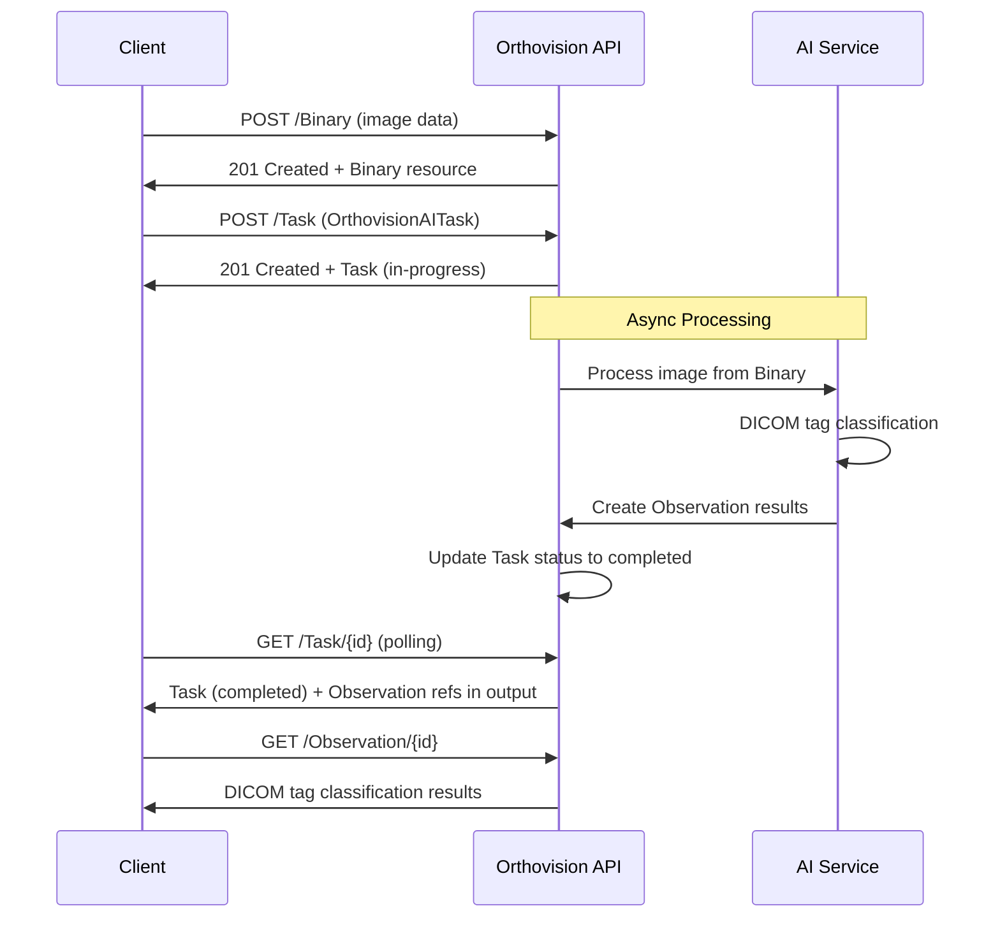

The following diagram shows the complete classification workflow using standard FHIR RESTful interactions:


## RESTful Workflow

### Step 1: Image Upload

**Endpoint**: `POST [base]/Binary`

**Input**: `OrthovisionAIBinary` resource with image data

```json
{
  "resourceType": "Binary",
  "contentType": "image/jpeg",
  "data": "base64EncodedImageData..."
}
```

**Response**: `HTTP 201 Created` with Binary resource and assigned ID

### Step 2: Task Creation

**Endpoint**: `POST [base]/Task`

**Input**: `OrthovisionAITask` resource specifying the classification request

```json
{
  "resourceType": "Task",
  "status": "requested",
  "intent": "order",
  "code": {
    "coding": [{
      "system": "http://hl7.org/fhir/CodeSystem/task-code",
      "code": "fulfill"
    }]
  },
  "focus": {
    "reference": "Binary/binary-12345"
  },
  "input": [
    {
      "type": {
        "coding": [{
          "system": "http://hl7.org/fhir/task-input-type",
          "code": "imagingStudy"
        }]
      },
      "valueReference": {
        "reference": "ImagingStudy/study-12345"
      }
    },
    {
      "type": {
        "coding": [{
          "system": "http://hl7.org/fhir/task-input-type",
          "code": "tagDICOM"
        }]
      },
      "valueString": "modality"
    },
    {
      "type": {
        "coding": [{
          "system": "http://hl7.org/fhir/task-input-type", 
          "code": "tagDICOM"
        }]
      },
      "valueString": "protocol"
    }
  ],
  "authoredOn": "2025-09-25T14:30:00Z"
}
```

**Response**: `HTTP 201 Created` with Task resource (status automatically changed to "in-progress")

**Note**: The `imagingStudy` input is optional and provides additional context to optimize AI processing.

### Step 3: Progress Monitoring

**Simple - Polling**: `GET [base]/Task/{id}`

Suggestion: Use exponential backoff for polling intervals.

### Step 4: Results Retrieval

When the Task status becomes `completed`, results are available via the Task output references:

**Final Results**: `OrthovisionAIObservation` resources containing DICOM tag classifications

**Example Modality Classification**: `GET [base]/Observation/modality-obs-12345`

```json
{
  "resourceType": "Observation",
  "id": "modality-obs-12345",
  "status": "final",
  "category": [{
    "coding": [{
      "system": "http://terminology.hl7.org/CodeSystem/observation-category",
      "code": "imaging"
    }]
  }],
  "code": {
    "coding": [{
      "system": "http://medoco.health/fhir/CodeSystem/dicom-tags",
      "code": "modality"
    }]
  },
  "valueCodeableConcept": {
    "coding": [{
      "code": "XC",
      "display": "External Photography"
    }]
  },
  "extension": [{
    "url": "http://medoco.health/fhir/StructureDefinition/confidence-score",
    "valueDecimal": 0.97
  }]
}
```

**Example Protocol Classification**: `GET [base]/Observation/protocol-obs-12345`

```json
{
  "resourceType": "Observation", 
  "id": "protocol-obs-12345",
  "status": "final",
  "category": [{
    "coding": [{
      "system": "http://terminology.hl7.org/CodeSystem/observation-category",
      "code": "imaging"
    }]
  }],
  "code": {
    "coding": [{
      "system": "http://medoco.health/fhir/CodeSystem/dicom-tags",
      "code": "protocol"
    }]
  },
  "valueString": "Frontal Facial view",
  "extension": [{
    "url": "http://medoco.health/fhir/StructureDefinition/confidence-score", 
    "valueDecimal": 0.89
  }]
}
```

## Advanced Features

### Confidence Scores

All `OrthovisionAIObservation` resources include confidence scores via the `confidence-score` extension, providing transparency into AI model certainty:

```json
{
  "resourceType": "Observation",
  "valueCodeableConcept": {
    "coding": [{"code": "XC", "display": "External Photography"}]
  },
  "extension": [{
    "url": "http://medoco.health/fhir/StructureDefinition/confidence-score",
    "valueDecimal": 0.97
  }]
}
```

### Error Handling

Failed requests return `OperationOutcome` with specific error codes:

```json
{
  "resourceType": "OperationOutcome",
  "issue": [{
    "severity": "error",
    "code": "invalid",
    "details": {
      "coding": [{
        "system": "http://medoco.health/fhir/CodeSystem/orthovision-ai-error-codes",
        "code": "unsupported-image-format"
      }]
    },
    "diagnostics": "Only JPEG, PNG, JP2, and DICOM images are supported. Received: image/bmp"
  }]
}
```

### Optional Context with ImagingStudy

Tasks can include optional `ImagingStudy` references in the input to provide additional DICOM metadata context for more accurate classification. This is particularly useful when the Binary contains raw image data but additional DICOM study information is available:

```json
{
  "focus": {
    "reference": "Binary/image-binary-12345"
  },
  "input": [
    {
      "type": {
        "coding": [{
          "system": "http://hl7.org/fhir/task-input-type",
          "code": "imagingStudy"
        }]
      },
      "valueReference": {
        "reference": "ImagingStudy/study-12345"
      }
    },
    {
      "type": {
        "coding": [{
          "system": "http://hl7.org/fhir/task-input-type",
          "code": "tagDICOM"
        }]
      },
      "valueString": "modality"
    }
  ]
}
```

This approach allows the AI service to use both the raw image data (from the Binary) and structured DICOM metadata (from the ImagingStudy) for improved classification accuracy.

## Performance & Scalability

- **RESTful Design**: Standard FHIR interactions enable caching, load balancing, and horizontal scaling
- **Async Processing**: Task-based workflow prevents client timeouts during AI inference
- **Resource Independence**: Each Binary, Task, and Observation can be processed independently
