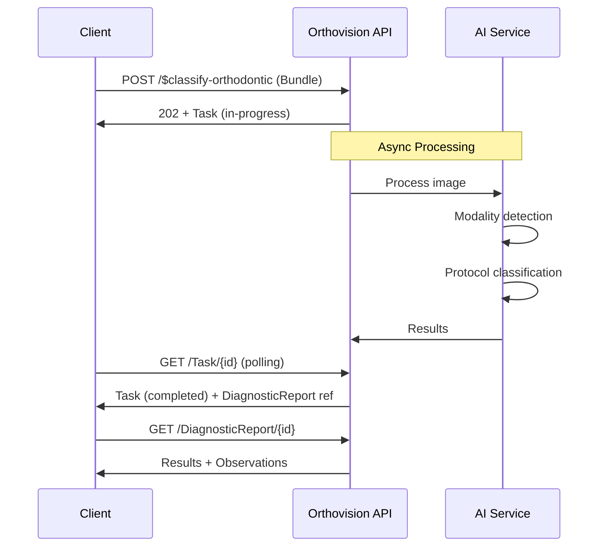

The following diagram shows the complete classification workflow:


## Endpoints

### Image Submission

**Endpoint**: `POST [base]/$classify-orthodontic`

**Input**: `OrthovisionAIBundle` containing:
- **Required**: `OrthovisionAIBinary`
- **Optional**: `ImagingStudy` (provides context to optimize processing)

```json
{
  "resourceType": "Bundle",
  "type": "collection",
  "entry": [
    {
      "resource": {
        "resourceType": "Binary",
        "contentType": "image/jpeg",
        "data": "base64EncodedImageData..."
      }
    }
  ]
}
```

### Immediate Response

**Response**: `HTTP 202 Accepted` with `OrthovisionAITask`

```json
{
  "resourceType": "Task",
  "id": "task-12345",
  "status": "in-progress",
  "intent": "order",
  "code": {
    "coding": [{
      "system": "http://medoco.health/fhir/CodeSystem/orthovision-ai-task-types",
      "code": "classify-orthodontic"
    }]
  },
  "focus": {
    "reference": "Bundle/input-bundle-12345"
  },
  "authoredOn": "2025-09-18T14:30:00Z",
  "businessStatus": {
    "text": "Image received, queued for processing"
  }
}
```

### Progress Monitoring

**Option A - Polling**: `GET [base]/Task/{id}`

**Option B - Real-time**: `GET [base]/Task/{id}/$stream` (Server-Sent Events)

```
data: {"status": "in-progress", "businessStatus": "Running modality detection"}
data: {"status": "in-progress", "businessStatus": "Running protocol classification"}  
data: {"status": "completed", "output": {"valueReference": "DiagnosticReport/result-12345"}}
```

### Results Retrieval

When the Task status becomes `completed`, results are available via the Task output reference:

**Final Results**: `OrthovisionAIDiagnosticReport` containing:
- **Modality Classification**: `OrthovisionAIModalityObservation`
- **Protocol Classification**: `OrthovisionAIProtocolObservation`

```json
{
  "resourceType": "DiagnosticReport",
  "status": "final",
  "code": {
    "coding": [{
      "system": "http://medoco.health/fhir/CodeSystem/orthovision-ai-procedures",
      "code": "orthovision-ai-classification"
    }]
  },
  "conclusion": "External-camera Photography (XC) - Frontal Facial view identified with high confidence",
  "result": [
    {"reference": "Observation/modality-obs-12345"},
    {"reference": "Observation/protocol-obs-12345"}
  ]
}
```

## Advanced Features

### Optional Classification Scores

Include `?includeClassificationScores=true` to receive complete AI model outputs with confidence scores for all possible classifications:

```json
{
  "resourceType": "Observation",
  "valueCodeableConcept": {
    "coding": [{"code": "XC", "display": "External Photography"}]
  },
  "extension": [{
    "url": "http://medoco.health/fhir/StructureDefinition/orthovision-ai-classification-scores",
    "extension": [
      {
        "extension": [
          {"url": "code", "valueCodeableConcept": {"coding": [{"code": "XC"}]}},
          {"url": "confidence", "valueDecimal": 0.97}
        ]
      },
      {
        "extension": [
          {"url": "code", "valueCodeableConcept": {"coding": [{"code": "DX"}]}},
          {"url": "confidence", "valueDecimal": 0.02}
        ]
      }
    ]
  }]
}
```

### Error Handling

Failed requests return `OperationOutcome` with specific error codes:

```json
{
  "resourceType": "OperationOutcome",
  "issue": [{
    "severity": "error",
    "code": "invalid",
    "details": {
      "coding": [{
        "system": "http://medoco.health/fhir/CodeSystem/orthovision-ai-error-codes",
        "code": "unsupported-image-format"
      }]
    },
    "diagnostics": "Only JPEG, PNG, JP2, and DICOM images are supported. Received: image/bmp"
  }]
}
```

## Performance

- **Burst Handling**: Designed for intermittent high-volume scenarios (500+ images in short periods)
- **Async Processing**: Prevents client timeouts during AI model inference
- **Optional Context**: ImagingStudy context can skip modality detection for faster processing

## Scalability

- **Stateless Operations**: Each classification request is independent
- **Load Balancing**: Compatible with horizontal scaling architectures
